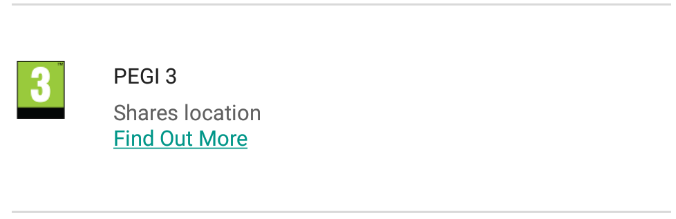
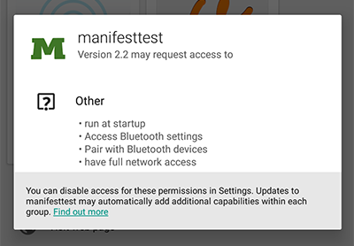
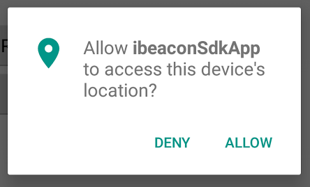

# inBeacon android java SDK guide

<table>
  <tr>
    <td>Date</td>
    <td>Changelog</td>
  </tr>
  <tr>
    <td>28-sep-2016</td>
    <td>New SDK version 1.6.1
Support for Android N / SDK 24. </td>
  </tr>
  <tr>
    <td>15-jun-2016</td>
    <td>Background modes explained</td>
  </tr>
  <tr>
    <td>3-may-2016</td>
    <td>New SDK version 1.5.0
Support for Android 6 / SDK 23.  Permissions added</td>
  </tr>
  <tr>
    <td>25-apr-2016</td>
    <td>New SDK version 1.4.0</td>
  </tr>
  <tr>
    <td>19-apr-2016</td>
    <td>Information about permissions</td>
  </tr>
  <tr>
    <td>15-apr-2016</td>
    <td>New SDK version 1.3.21 </td>
  </tr>
  <tr>
    <td>14-dec-2015</td>
    <td>Android API level 23 SDK / Android 6 
new SDK version 1.3.12 with android 6 support</td>
  </tr>
  <tr>
    <td>21-sep-2015</td>
    <td>new SDK version 1.3.11</td>
  </tr>
  <tr>
    <td>18-sep-2015</td>
    <td>new SDK version 1.3.7 - 1.3.10</td>
  </tr>
  <tr>
    <td>2-jul-2015</td>
    <td>new SDK version 1.3.6</td>
  </tr>
  <tr>
    <td>1-jul-2015</td>
    <td>new SDK version 1.3.5</td>
  </tr>
  <tr>
    <td>1-jul-2015</td>
    <td>new SDK version 1.3.4</td>
  </tr>
  <tr>
    <td>24 jun 2015</td>
    <td>new SDK version 1.3
- use of maven for dependencies
- removal of inBeaconApplication
- Android API 22
- Support for fast bluetooth handling on Android 5</td>
  </tr>
  <tr>
    <td>16 apr 2015</td>
    <td>included Dex method count</td>
  </tr>
  <tr>
    <td>11 oct 2014</td>
    <td>SDK release 1.0.1</td>
  </tr>
  <tr>
    <td>9 oct 2014</td>
    <td>SDK release 1.0.0</td>
  </tr>
  <tr>
    <td>6 oct 2014</td>
    <td>Preliminary draft</td>
  </tr>
  <tr>
    <td>15 aug 2014</td>
    <td>Initial </td>
  </tr>
</table>

This document describes the latest version of the inBeacon android java SDK

© 2015 inBeacon BV.

Padualaan 8 

UtrechtInc Room W129 

3584 CH Utrecht 

The Netherlands

Author:  Ronald van Woensel

Contact: ronald@inbeacon.nl

[[TOC]]

# inBeacon SDK for Android

Implementing the inBeacon SDK for android requires a few lines of code and normally takes less than 1 hour of work. However before starting, lets take a look at some important considerations

## Key implementation facts and considerations

### Dex method footprint

Because of the 65K method limit for android applications, large applications that add a lot of SDK’s might become too large containing more than 65K methods

The number of methods used by the inBeaconSDK is 793 methods (version 1.3.4)

This is excluding the dexcount of the dependencies as they will probably already be used:

* com.android.support:support-v4

* com.loopj.android:android-async-http

### Memory footprint

classes.jar: 50k

4.0K	contents//aapt

  0B	contents//aidl

  0B	contents//assets

8.0K	contents//res/drawable-hdpi

4.0K	contents//res/drawable-ldpi

 68K	contents//res/drawable-mdpi

 84K	contents//res/drawable-xhdpi

104K	contents//res/drawable-xxhdpi

188K	contents//res/drawable-xxxhdpi

4.0K	contents//res/layout

680K	contents//res/raw

1.1M	contents//res

1.2M	contents/

Difference between compiled apk with and without inBeaconSDK: 970k (including icon and sound resources)

### Battery life

The inbeacon SDK uses sleep-mode whenever there are no beacons with your ID around. This means that we can limit extra battery usage during normal operation. Bluetooth scanning takes place only for a few seconds every minute. On average we see a decrease of battery life of aboutf 1-2% for the device. 

When beacons with your ID are within range (approx 30 meters),  bluetooth scanning is done continuously, and battery use increases as well. Of course, only a few people will be within the ranges of your beacons, and also for a short time. 

**Note:** The inbeacon SDK only wakes up for **_your beacons_** (beacon UUID’s defined in the region table of your account)  Other beacons have no influence on the inbeacon SDK.

### Permissions 

For the SDK to work, the app needs the following (extra) permissions:

* BLUETOOTH

* BLUETOOTH_ADMIN

* RECEIVE_BOOT_COMPLETED

* ACCESS_COARSE_LOCATION  (api 23 / android 6 only)

How these permissions impact installation and use of the app differs per android version and per targeted API of the app.

#### Android versions 5 (lollipop) and lower  OR

#### Apps targeted at API versions 22 and lower 

Android versions 5 and lower ask for all permissions during install. 

Also, on android 6, older apps targeted for API versions 22 and lower will have the same behaviour, as these are grandfathered into the new adroid version.

### Installation

On installation, the app asks for the extra permission "Bluetooth" 

### App update

If the app is updated and did not yet have permission for one of the bluetooth values, the app is **NOT** automatically updated because of the extra permission needed. Updating leads to the following question

#### **Android versions 6 (marshmallow) and **up** with a**pps targeted at API versions 23 onwards

**Installs and updates for the these apps are done without asking for permissions. **

Permissions are asked during use of the app. In the "read more" section, it is mentioned that the app “shares location” because of the extra COARSE_LOCATION permission requirement.

And in the "permission details" menu, it is mentioned that the app can use bluetooth functionaties and run at startup. However this list must requested by the user and is not shown upon install by default.

When the app is run, permission for COARSE_LOCATION (or FINE_LOCATION) needs to be requested in order to detect beacons:

### App in the background and locked (screen off) devices

Special care is taken to allow beacon scanning to continue in the background. 

* When the app activity is closed (back-button) the SDK goes into background mode. In this mode, beacon scanning is slower to preserve battery, but still every beacon is detected within 10 seconds

* When the phone is locked (screen off) the SDK works in background mode

* When the app is swiped-out from the task menu, an alert is set to wake the app again after 5 minutes. In this case the app is started in background mode only, without activity so it is not shown on the task menu again

* Unplugging or plugging in the USB charger has the same effect as the 5 minutes alert. It will restart the app in background mode immdiately after it is swiped-out from the task menu

* When the app is force-stopped the SDK becomes inactive. The 5 minute resume or the usb plugin trigger are disabled. Scanning will restart only after a fresh app restart.

* DOZE mode. Android 6 Marshmellow introduces doze mode where the device cycles through IDLE and IDLE_MAINTENANCE mode when the device is inactive and on battery. In IDLE mode, internet connection is off, so apps have to wait for an IDLE_MAINTENANCE window in order to connect to backends. Doze mode does not have any impact on beacon scanning, but without internet connection devices will not be able to process on-line trigger events.

However because Doze-mode is only activated for devices that are not moving (GPS and accelerometer) (for instance lying on a table) we expect doze mode not to have any practical impact on the SDK as people will probably will be on the move during interactions.  

## Integrating inBeacon in an Android Studio project

### JCenter (recommended)

Add JCenter to your build file's list of repositories, and include

dependencies {

compile('com.inbeacon:android.sdk:1.+@aar'){ transitive = true }

}

to your gradle dependencies. See bintray for details:

[https://bintray.com/inbeacon/maven/android.sdk/view](https://bintray.com/inbeacon/maven/android.sdk/view)

You can use a dynamic version (1.+) to get the latest 1.x version of the SDK (recommended)

### Binary release 

If you don’t want to use the JCenter repository, you can download and include all files manually.

The inBeacon SDK .aar is included in the download package from console.inbeacon.nl along with the example.

To include the .aar in your android studio project, copy the aar file to the app/libs directory and include:

repositories {

   flatDir {

       dirs 'libs'

   }

}

compile 'com.android.support:support-v4:22.2.0'

compile 'org.altbeacon:android-beacon-library:2.8.1'

compile 'com.loopj.android:android-async-http:1.4.9'

compile(name:'android.sdk-release', ext:'aar')

In this case you need to specify some dependencies by hand.

Now you are set to go. Try to compile and see that your app is still working. Now you need to add some code to start the inBeacon SDK.

## Sample app

You will find a sample Android Studio project in the SDK download package, and on github:

[https://github.com/inbeacon/inbeacon-sdk-android-example](https://github.com/inbeacon/inbeacon-sdk-android-example)

# Implementing the SDK

## Minimal implementation

You need to create your own application class to enable working with the inBeacon SDK.

In this class, initialize the inBeacon SDK from the onCreate of the application:

**import **android.app.Application;

**import **com.inbeacon.sdk.InbeaconManager;

**import **java.util.HashMap;

**public class **myApp **extends **Application {

   @Override

   **public void **onCreate() {

       **super**.onCreate();

       *// initialize with your ClientID and Secret.*

*       *InbeaconManager.*initialize*(**this**, **"<<your client Id>>"**, **"<<client Secret>>"**);

       *// refresh data from server. *

*       *InbeaconManager.*getSharedInstance*().refresh();

   }

}

You can find your client-ID and client-Secret in your account overview on [http://console.inbeacon.nl/accmgr ](http://console.inbeacon.nl/accmgr)

Now you have to make sure MyApplication is used as the application class by adding the following to your application in AndroidManifest.xml (in bold):

<manifest xmlns:android="http://schemas.android.com/apk/res/android"

    package="com.inbeacon.inbeaconsdkaartest" >

    <application

       ** android:name=".MyApp"**

	...

    </application>

</manifest>

If you compile against Android SDK 23 (compileSdkVersion 23) you also need to ask the user permission to use the device COARSE_LOCATION. For convenience, the inBeacon SDK contains a method **askPermissions** to do this. Include this statement in your main activity (in bold):

**public class **MyActivity **extends **Activity  { 

@Override

**protected void **onCreate(Bundle savedInstanceState) {

			...

**InbeaconManager.****_getSharedInstance_****().askPermissions(****this****);**

**_This is all you have to do for a basic inBeacon SDK integration._** From now on you can manage proximity notifications with Beacons that you define in the inbeacon backend.  

Notice that even if you close the app or force-close the app, the inBeacon SDK service will restart at the moment you plug in or remove your charger or reboot the device. This means that Beacons that you define in the inBeacon backend are detected even if the user has put the app in the background or terminated the app. 

## Using the core SDK classes and methods

There are 4 sdk methods that are required for normal inBeacon integration: 

* initialize

* attach a user

* detach a user

* refresh

Additional methods exist, but they are not required for normal operation. 

Also you can receive LocalBroadcasts for specific events, but these are also not required for normal operation.

## The InbeaconManager class

This is the main manager class that does all the heavy lifting. Notice that the inbeaconApplication class handles all initialisations of the InbeaconManagerclass. 

<table>
  <tr>
    <td>Static Methods</td>
    <td></td>
  </tr>
  <tr>
    <td>getSharedInstance()</td>
    <td>retrieves the shared InbeaconManager class </td>
  </tr>
</table>

<table>
  <tr>
    <td>Methods</td>
    <td></td>
  </tr>
  <tr>
    <td>attachUser(HashMap<String,String> user) </td>
    <td>Attach local (device) user information to inbeacon.</td>
  </tr>
  <tr>
    <td>detachUser()</td>
    <td>Removes local device user.</td>
  </tr>
  <tr>
    <td>refresh()</td>
    <td>This starts all services and obtains new information from the server. You should call Refresh every once in a while to make sure server information is updated.</td>
  </tr>
  <tr>
    <td>verifyCapabilities()</td>
    <td>Checks for correct hardware and SDK version.
Returns one of the following values: 
Enum com.inbeacon.sdk.InbeaconManager.VerifiedCapability
VerifiedCapability.CAP_OK 
VerifiedCapability.CAP_SDK_TOO_OLD
VerifiedCapability.CAP_BLUETOOTH_DISABLED
VerifiedCapability.CAP_BLUETOOTH_LE_NOT_AVAILABLE
</td>
  </tr>
  <tr>
    <td>askPermissions(Activity activity)
</td>
    <td>Convenience method to ask COARSE_LOCATION permissions for SDK 23, needed for the use of beacons
(safe to call with SDK 22 and lower, in this case it does nothing)

</td>
  </tr>
</table>

### InbeaconManager initialize

Initialize the SDK with your clientID and clientSecret. These credentials are used for communication with the server. 

	**in****itialize****(context,<your clientid>,<your clientsecret>);**

### attachUser

Attach local userinformation to inbeacon. For instance, the user might enter account information in the app. It is also possible not to attach a user, in that case the device is anonymous. The device id is always communicated however on iOS this uuid is no longer related to the hardware UUID.

There are a lot of fields avaiable for userinformation, however none of them are required. Just supply the available information.

// User object can contain 

//	'name', 'email', 'customerid' (your own id, any string, for reference), 

//	‘address’, ‘gender’ ("male" | “female”) ,

//    ‘zip’, ‘city’, ‘country’, ‘birth’ (string format yyyymmdd), ‘phone_mobile’,

// 	’phone_home’, ‘phone_work’,

//    ‘social_facebook_id’,’social_twitter_id’,’social_linkedin_id’

	// EXAMPLE:

HashMap<String, String> user=new HashMap<String, String>(); 

user.put("name","Dwight Schulz");

user.put("email","dwight@ateam.com");

InbeaconManager.getSharedInstance().attachUser(user);	

You can also call AttachUser from any other class, for instance from the main acitivity using the shared instance.

	

### DetachUser

Log out the current current user. From now only anonymous info is send to inBeacon server.

InbeaconManager.getSharedInstance().**d****etachUser();**

### Refresh

Obtain fresh trigger and region information from the inBeacon platform. Best practice is to call this when the app is 

* started

* returned to the foreground

so info is kept updated. 

	InbeaconManager.*getSharedInstance*().refresh();

### SDK 23 - getting Permission

If you do not want to use the bare-bones **askPermissions** method provided by the SDK, you can roll your own. 

You might use this example code to make a more advanced permission request:

**public class **myActivity **extends **Activity  { 

@Override

**protected void **onCreate(Bundle savedInstanceState) {

**super**.onCreate(savedInstanceState);

		...

**if **(Build.VERSION.**_SDK_INT _**>= Build.VERSION_CODES.**_M_**) {

   *// Android M Permission check
*

*   ***if **(**this**.checkSelfPermission(Manifest.permission.**_ACCESS_COARSE_LOCATION_**) != PackageManager.**_PERMISSION_GRANTED_**) {

       **final **AlertDialog.Builder builder = **new **AlertDialog.Builder(**this**);

       builder.setTitle(**"This app needs location access"**);

       builder.setMessage(**"Please grant location access so this app can detect beacons."**);

       builder.setPositiveButton(android.R.string.**_ok_**, **null**);

       builder.setOnDismissListener(**new **DialogInterface.OnDismissListener() {

           @Override

           **public void **onDismiss(DialogInterface dialog) {

               requestPermissions(**new **String[]{Manifest.permission.**_ACCESS_COARSE_LOCATION_**}, **_PERMISSION_REQUEST_COARSE_LOCATION_**);

           }

       });

       builder.show();

   }

}

		..

	}

@Override

**public void **onRequestPermissionsResult(**int **requestCode,

                                      String permissions[], **int**[] grantResults) {

   **switch **(requestCode) {

       **case ****_PERMISSION_REQUEST_COARSE_LOCATION_**: {

           **if **(grantResults[0] == PackageManager.**_PERMISSION_GRANTED_**) {

               Log.*d*(**_TAG_**, **"coarse location permission granted"**);

           } **else **{

               **final **AlertDialog.Builder builder = **new **AlertDialog.Builder(**this**);

               builder.setTitle(**"Functionality limited"**);

               builder.setMessage(**"Since location access has not been granted, this app will not be able to discover beacons when in the background."**);

               builder.setPositiveButton(android.R.string.**_ok_**, **null**);

               builder.setOnDismissListener(**new **DialogInterface.OnDismissListener() {

                   @Override

                   **public void **onDismiss(DialogInterface dialog) {

                   }

               });

               builder.show();

           }

           **return**;

       }

   }

}

	…

}

### SDK 22 and older - proguard warnings

If you generate apk’s with proguard with TargetSDK 22 or lower, you need to disable warnings for the new permission checks. Add the following line to your proguard-rules.pro file:

# inbeacon

-dontwarn com.inbeacon.sdk.**

## Calling the inBeaconSDK manager from an Activity or any other class 

At any moment it is possible to obtain the inBeaconManager class by using:

InbeaconManager inbManager = InbeaconManager.getSharedInstance();

For instance you normally want to refresh the inBeacon information when your main Activity starts. This can be done like this:

@Override

protected void onCreate(Bundle savedInstanceState) {

super.onCreate(savedInstanceState);

setContentView(R.layout.activity_sdk_test);

...

**HashMap<String, String> user=new HashMap<String, String>();**

**user.put("name","Dwight Schulz");		// EXAMPLE!!**

**user.put("email","****[dwight@ateam.co**m](mailto:dwight@ateam.com)**");	// EXAMPLE!!**

**InbeaconManager.getSharedInstance().attachUser(user);	// attach the user**

**InbeaconManager.getSharedInstance().refresh();		// refresh all info**

		...

## Receiving inBeaconSDK events 

The inBeacon event mechanism uses a LocalBroadcastManager and intents with actions. To listen to specific events, you need to create an intentfilter and a MessageReceiver like this: 

IntentFilter myIntentFilter=new IntentFilter("com.inbeacon.sdk.event.enterregion");

LocalBroadcastManager.getInstance(this).registerReceiver(	mMessageReceiver,

           								myIntentFilter);

The messageReceiver class can be defined like this:

    private BroadcastReceiver mMessageReceiver = new BroadcastReceiver() {

        @Override

        public void onReceive(Context context, Intent intent) {

            Bundle extras=intent.getExtras();

            Log.w("receiver", "Got action="+intent.getAction()+" extras="+extras);

        }

    };

also you could include more than one inbeacon event in the intentfilter to receive more than one action, like this (this intentfilter listens to all available inbeacon messages):

IntentFilter myIntentFilter=new IntentFilter();

myIntentFilter.addAction(**"com.inbeacon.sdk.event.enterregion"**);     *// user entered a region*

myIntentFilter.addAction(**"com.inbeacon.sdk.event.exitregion"**);      *// user left a region*

myIntentFilter.addAction(**"com.inbeacon.sdk.event.enterlocation"**);   *// user entered a location*

myIntentFilter.addAction(**"com.inbeacon.sdk.event.exitlocation"**);    *// user left a location*

myIntentFilter.addAction(**"com.inbeacon.sdk.event.regionsupdate"**);   *// region definitions were updated*

myIntentFilter.addAction(**"com.inbeacon.sdk.event.enterproximity"**);  *// user entered a beacon proximity*

myIntentFilter.addAction(**"com.inbeacon.sdk.event.exitproximity"**);   *// user left a beacon proximity*

myIntentFilter.addAction(**"com.inbeacon.sdk.event.proximity"**);       *// low level proximity update, once every second when beacons are around*

myIntentFilter.addAction(**"com.inbeacon.sdk.event.appevent"**);        *// defined in the backend for special app-specific pages to show*

myIntentFilter.addAction(**"com.inbeacon.sdk.event.appaction"**);       *// defined in the backend to handle your own local notifications*

Example:

<table>
  <tr>
    <td>public class sdkTest extends Activity { 
    private static final String TAG = "sdkTestActivity";
    private BroadcastReceiver mMessageReceiver = new BroadcastReceiver() {
        @Override
        public void onReceive(Context context, Intent intent) {
            Bundle extras=intent.getExtras();
            Log.w(TAG, "Got action:"+intent.getAction()+" extras:"+extras);
        }
    };
    @Override
    protected void onCreate(Bundle savedInstanceState) {
        super.onCreate(savedInstanceState);
        setContentView(R.layout.activity_sdk_test);

        IntentFilter myIntentFilter=new IntentFilter();
        myIntentFilter.addAction("com.inbeacon.sdk.event.appaction");
        LocalBroadcastManager.getInstance(this).registerReceiver(mMessageReceiver,myIntentFilter);
    }
}</td>
  </tr>
</table>

### com.inbeacon.sdk.event.enterregion

**com.inbeacon.sdk.event.exitregion**

Fired when device enters or leaves a region (single UUID)

intent Extras:region information

### com.inbeacon.sdk.event.enterlocation

**com.inbeacon.sdk.event.exitlocation**

Fired when device enters or leaves a location (UUID, Major)

intent Extras:location information

### com.inbeacon.sdk.event.enterproximity

**com.inbeacon.sdk.event.leaveproximity**

Fired when device enters or leaves a beacon proximity (UUID, Major, minor, proximity )

### intent Extras: proximity information

### com.inbeacon.sdk.event.proximity

Low level beacon proximity event.

Fired when device proximity to a defined Beacon changes. This event is normally fired once every second when a beacon is in range

intent Extras: Beacon information and proximity to beacon (near/far/immediate)

### com.inbeacon.sdk.event.regionsupdate

Fired when the region definition has been retrieved and updated from the server

intent Extras: none.

### com.inbeacon.sdk.event.appaction

Special case: It is possible to have inBeacon fire a trigger that uses the app logic to handle the Local Notification. The app is responsible for handling trigger event and showing a notifcation or doing other things. 

intent Extras: Action information from this trigger that is normally used to define the Local Notification

### com.inbeacon.sdk.event.appevent

Special case: It is possible to have inBeacon fire a trigger that uses the app logic to handle the Activity that is activated when the user enters the notification. 

intent Extras: Page information from this trigger with app-argument given in the backend:

# Changelog

### SDK version 1.6.1

* Android N / SDK 24 support

* Offline triggers without internet connection do not wait on server timeout for notification

### SDK version 1.4.0

* inBeacon v4 mobile api

* inBeacon Account setttings persisted on device

* New mobile endpoint [https://mapi.inbeacon.nl](https://mapi.inbeacon.nl) used

### SDK version 1.3.21

* Utf-8 bugfix. User data with non-ASCII characters (utf-8 multibyte) was not transferred correctly

### SDK version 1.3.12

* Compile SDK 23. Support for android 6

### SDK  version 1.3.11

* Shrink resources will not remove custom sounds 

### SDK  version 1.3.7 1.3.8 1.3.9 1.3.10

* bug fix: Various workarounds for android pendingintent bug 

* new cha-ching and sadtrombone sounds

### SDK  version 1.3.6

* bug fix: Back to default Holo theme when notification activity is started

### SDK  version 1.3.5

* bug fix: async response on dead thread

### SDK version 1.3.4

* Regular Server updates when in region  (ibeacon/update)

* Custom sounds, icons and colors of notifications

* Custom titlebar colors

* advertisement ID included in device/sync

* refresh when entering region.

### SDK version 1.3.3

* wakeup and background modes

* bluetooth timing & tuning

* Custom sounds

### SDK version 1.3.2

* bugfixes

### SDK version 1.3.1

* Support for fast bluetooth handling on Android 5

### SDK version 1.3.0

* inBeacon v3 mobile API

* updated android tools and API level 22

* use of jcenter for dependencies

* removal of inBeaconApplication class

* Android API 22

### SDK version 1.0.3

* bugfixes

### SDK version 1.0.1

* iinitial version

# SDK license

Grant of License. inBeacon bv grants to you:

(a) A nonexclusive, nontransferable, worldwide, royalty-free right and license to use, copy and distribute the Software in conjunction with the distribution of your own products (the 'Products') and

(b) A nonexclusive, nontransferable, worldwide, royalty-free right and license to use the relevant and necessary components of the Software solely to incorporate the Software into the Products.

Proprietary Rights.

inBeacon BV and its licensors own, and shall retain ownership of, all right, title, and interest to the Software, including, without limitation, all copyrights and other intellectual property rights therein. Without limiting the foregoing, the Software is protected by Dutch copyright laws and international treaty provisions. Therefore, you may not use, copy, or distribute the Software without authorization.

Restrictions.

You may not (1) modify, create derivative works of, reverse engineer, reverse compile, or disassemble the Software, except that you may modify and create derivative works based upon the sample source code included within the Software (the 'Sample Code') and distribute the modified Sample Code in connection with the Product ; (2) distribute, sell, lease, rent, lend, or sublicense any part of the Software to any third party except as expressly provided herein and as necessary to distribute the Product; (3) use the Software to develop software to upload or otherwise transmit any material containing software viruses or other computer code, files or programs designed to interrupt, destroy, or limit the functionality of any software or hardware.

You may not represent that the Products are certified or otherwise endorsed by inBeacon BV. 

You will not receive any support or subscription services for the Software or any services from inBeacon BV in connection with the Software, except as expressly provided in this Agreement.

