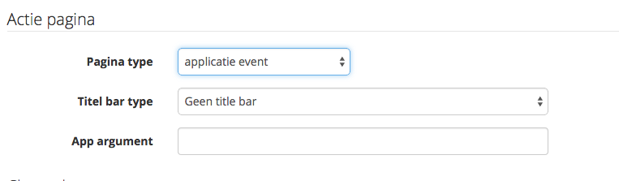

# Using the SDK
## InbeaconManager class

This is the main class that you communicate with.

### initialize() 
Initialize the SDK with your credentials. This will create a singleton instance and starts the SDK. 
Always call initialize from the Application class.


```java
static InbeaconManagerInterface initialize(Context context, String clientId, String clientSecret)
```
Initialize the SDK with your clientID and clientSecret. These credentials are used for communication with the server.
You can find your client-ID and client-Secret in your [account overview](https://console.inbeacon.nl/account) 

>Example:
>Initialize the SDK in your Appliction object in the `onCreate` method as follows:
>
```java
public class myApp extends Application {
    @Override
    public void onCreate() {
        super.onCreate();
        InbeaconManager.initialize(this, "<<your client-ID>", "<<your client-Secret>>");    
        ...
    }
	...
}    
```


> For older devices with API level <=18 the initialization will be silently ignored. The inBeacon SDK is disabled for these API levels.

### getInstance() 
Retrieves the shared InbeaconManager singleton class 

```java
static InbeaconManagerInterface getInstance();
static InbeaconManagerInterface getSharedInstance(); // backward compatibility
```
>Example: At any moment it is possible to obtain the inBeaconManager instance, for example within an Activity:
>
```java
...
InbeaconManager inbManager = InbeaconManager.getInstance();
userPropertyService = inbManager.getUserPropertyService();
```


### getUserPropertyService() - access user properties and tags

```java
UserPropertyService getUserPropertyService();
```
Returns an instance of the UserPropertyService which allow user properties to be managed. See UserPropertyService description below.

### setLogLevel
In order to get more logging, the loglevel might be increased. The level is Log.NONE by default, so no logging is shown.
 
```java
void setLogLevel(long level);
// any of the standard levels: Log.WARNING Log.INFO Log.DEBUG Log.ERROR Log.VERBOSE  
```
>Example: it is possible to increase the loglevel before initialisation
>
```java
...
InbeaconManager.getInstance().setContext(this).setLogLevel(Log.INFO);
InbeaconManager.getInstance().setCredentials("client-id", "client-secret");   
InbeaconManager.getInstance().start();  // and we're off
```

### getLogLevel
returns the current log level

    long getLogLevel();


	
### verifyCapabilities
Checks for correct hardware and SDK version.

```java
    VerifiedCapability verifyCapabilities();
```

Returns one of the following values: 

```java
Enum com.inbeacon.sdk.InbeaconManager.VerifiedCapability
VerifiedCapability.CAP_OK 
VerifiedCapability.CAP_SDK_TOO_OLD
VerifiedCapability.CAP_BLUETOOTH_DISABLED
VerifiedCapability.CAP_BLUETOOTH_LE_NOT_AVAILABLE
```

### askPermissions(Activity activity)
Convenience method to ask FINE_LOCATION permissions for SDK 23, needed for the use of beacons and geofences
(safe to call with SDK 22 and lower, in this case it does nothing)

```java
    void askPermissions(Activity activity);
```

See example code if you want to roll your own.

### refresh() - obsolete
This starts all services and obtains new information from the server. 

```java
    void refresh();  // now obsolete. Done automatically
```


## UserPropertyService

The inBeacon backend has user information for each device. The user information are properties that fall in any of the 3 categories:

* Fixed properties. These always exist and control specific functionality. These are the fixed properties
  - `name`: Full user name, both first and family name. Example ‘Dwight Schulz’
  - `email`: User email. Example: ‘dwight@a-team.com’
  - `gender`: User gender: male, female or unknown
  - `country`: ISO3166 country code
  - `id`: inBeacon unique user id (read-only)
  - `avatar`: URL to user avatar

* Custom properties. You can define other properties, like "facebook-ID" or "my-ID". Properties can be String, long, double or boolean type.

* Tags. Users can be tagged, a tag is a string that can be set or reset.

User properties are **persistent** on the device, and also **automatically synchronized with the backend** and thus will **survive an app re-install** (on both iOS and Android)

Replication with the backend works both ways: Local updates are send to the server, server updates are send to the app. Because the device initiates the communication, updates from server to device do not occur immediately but will have to wait until the device starts the next communication cycle.

> Note: Properties cannot be removed once created. Tags can be reset, which removes the tag.


>Example:
>
```java
userPropertyService.putPropertyString("name", "Dwight Schulz");
userPropertyService.putPropertyLong("age", 55);
String name=userPropertyService.getPropertyString("name");
```

available methods

```java
    boolean hasProperty(String property);

    String getPropertyString(String property, String defaultValue);
    String getPropertyString(String property);
    void putPropertyString(String property, String value);

    long getPropertyLong(String property, long defaultValue);
    long getPropertyLong(String property);
    void putPropertyLong(String property, long value);

    double getPropertyDouble(String property, double defaultValue);
    double getPropertyDouble(String property);
    void putPropertyDouble(String property, double value);

    boolean hasTag(String tag);
    void setTag(String tag);
    void resetTag(String tag);
```

## Sending custom events or touchpoints

The SDK supports custom events that can be used for (examples)

* custom spot types that generate events just like beacons or geofences
* other types of events, for instance certain user actions inside the app

Different event-types are supported:

- eventtype **ONESHOT**. For unrelated events, a oneshot event is not connected to other events, and no time-spend is calculated.
- eventtype **IN** and **OUT**. For in/out eventtypes, a time-spend is calculated for example to measure dwell times. Also the in and out events are connected and kept for "currently in" and "currently not in" status calculation based on the eventID. A device can be inside more than one eventID at the same time.

Custom events can be used in the campaign designer and are stored as touchpoints and can be used in touchpoint analysis.

A custom event has 3 properties:

- an ID. The eventID should be defined in the inbeacon backend, otherwise triggering it will be ignored.
- an eventType, which can be IN, OUT or ONESHOT. (see com.inbeacon.sdk.Custom.EventType)
- (optional) extra data. This is a string with extra data for custom purposes to give more context.

### Triggering (sending) a custom event
There are 2 ways to trigger a custom event: Via an SDK method or with a local broadcast.

##### via an SDK method: triggerCustomEvent()

```java
void triggerCustomEvent(long eventId, EventType eventType, String extra) 
```
>Example: 
>
```java
import com.inbeacon.sdk.Custom.EventType;
...
InbeaconManager.getInstance().triggerCustomEvent(44L, EventType.ONESHOT, "some info");
```

##### via a local broadcast
>Example:
>
```
import com.inbeacon.sdk.Base.Constants;
...
Intent localIntent = new Intent(Constants.LocalBroadcasts.EVENT_CUSTOMEVENT);
localIntent.putExtra(Constants.LocalBroadcasts. EVENT_CUSTOMEVENT_EXTRADATA_EVENTID, 44L);  // long ID
localIntent.putExtra(Constants.LocalBroadcasts. EVENT_CUSTOMEVENT_EXTRADATA_EVENTTYPE, EventType.IN.name());
localIntent.putExtra(Constants.LocalBroadcasts. EVENT_CUSTOMEVENT_EXTRADATA_EXTRA, "extrastuff");
LocalBroadcastManager.getInstance(getApplicationContext()).sendBroadcast(localIntent);
```


## Receiving inBeaconSDK events 

The inBeacon event mechanism uses a LocalBroadcastManager and intents with actions. To listen to specific events, you need to create an intentfilter and a MessageReceiver like this: 

```java
import com.inbeacon.sdk.Base.Constants;
...
IntentFilter myIntentFilter=new IntentFilter(Constants.LocalBroadcasts.EVENT_PROXIMITY);
LocalBroadcastManager.getInstance(this).registerReceiver(mMessageReceiver,myIntentFilter);
```
The messageReceiver class can be defined like this:

```java
    private BroadcastReceiver mMessageReceiver = new BroadcastReceiver() {
        @Override
        public void onReceive(Context context, Intent intent) {
            Bundle extras=intent.getExtras();
            Log.w("receiver", "Got action="+intent.getAction()+" extras="+extras);
        }
    };
```

>Example:
>
```java
public class sdkTest extends Activity { 
    private static final String TAG = "sdkTestActivity";
    private BroadcastReceiver mMessageReceiver = new BroadcastReceiver() {
        @Override
        public void onReceive(Context context, Intent intent) {
            Bundle extras=intent.getExtras();
            Log.w(TAG, "Got action:"+intent.getAction()+" extras:"+extras);
        }
    };
    @Override
    protected void onCreate(Bundle savedInstanceState) {
        super.onCreate(savedInstanceState);
        setContentView(R.layout.activity_sdk_test);
        IntentFilter myIntentFilter=new IntentFilter();
        myIntentFilter.addAction(Contants.LocalBroadcasts.EVENT_APPEVENT);
        LocalBroadcastManager.getInstance(this).registerReceiver(mMessageReceiver,myIntentFilter);
    }
}
```

### EVENT_APPEVENT

It is possible to have inBeacon fire a trigger that uses the app logic to handle the Activity that is activated when the user opens the notification. 

intent Extras: 

*  EVENT\_APPEVENT\_EXTRADATA\_ARGUMENT - app argument given in backend. Can be any string (or json)




### EVENT\_USERINFO
fired when a user property has been changed. 

intent Extras:

* EVENT\_USERINFO\_EXTRADATA\_PROPERTY - property name
* EVENT\_USERINFO\_EXTRADATA\_SOURCE - "SERVER" or "DEVICE" - party responsible for change

### EVENT\_LOCATION

Fired when device enters or leaves a location. Normally you don't need to filter this event. Special use cases only. 

intent Extras:

* EVENT\_PROXIMITY\_EXTRADATA\_LOCATION - location id
* EVENT\_PROXIMITY\_EXTRADATA\_INOUT - "i" or "o" - enter or exit


### EVENT\_PROXIMITY

Fired when device enters or leaves a beacon proximity. Normally you don't need to filter this event. Special use cases only. 

intent Extras: 

* EVENT\_PROXIMITY\_EXTRADATA\_BEACON - beacon id
* EVENT\_PROXIMITY\_EXTRADATA\_PROXIMITY - near/far/immediate
* EVENT\_PROXIMITY\_EXTRADATA\_INOUT - "i" or "o" - enter or exit

### EVENT\_GEOFENCE

Fired when a device enters or leaves a geofence. Normally you don't need to filter this event. Special use cases only. 

intent Extras:

* EVENT\_GEOFENCE\_EXTRADATA\_FENCEID - geofence id
* EVENT\_GEOFENCE\_EXTRADATA\_INOUT - "i" or "o" - enter or exit


---
